# mysql


## chatgpt

### 学习mysql基础的路线


人工智能助手 (模型: Gpt-3.5-Turbo-16K)

当你开始学习MySQL时，以下是一条学习路线可以帮助你入门和提高技能：

1. **基础知识**
    - 了解数据库基本概念和术语，如表、字段、行、主键等。
    - 学习SQL语言基础，包括SELECT、INSERT、UPDATE和DELETE语句的使用。
2. **安装和设置**
    - 下载和安装MySQL数据库。
    - 配置和启动数据库服务器。
3. **数据库设计**
    - 学习如何设计数据库架构和规范化。
    - 掌握实体关系建模（ER模型）的基本概念。
4. **表操作**
    - 创建和删除表。
    - 设置字段属性，如数据类型、长度、约束等。
    - 学习索引的使用和创建。
5. **数据操作**
    - 插入、更新和删除数据。
    - 查询数据，包括使用条件、排序和限制查询结果。
    - 学习子查询、连接查询和聚合函数的使用。
6. **高级查询和优化**
    - 学习更复杂的查询技巧，如多表连接、嵌套子查询和分组。
    - 了解SQL优化技术，包括索引优化、查询优化和性能调优。
7. **事务管理**
    - 学习事务的概念和特性。
    - 了解数据库事务的 ACID属性。
    - 学习如何管理和控制事务。
8. **安全和权限**
    - 学习如何设置数据库用户和权限。
    - 了解常见的安全问题和防范措施。
9. **备份和恢复**
    - 了解数据库备份和恢复的重要性。
    - 学习如何执行数据库备份和恢复操作。
10. **性能监控和故障处理**
    - 学习如何监控数据库性能。
    - 掌握常见的故障处理技术，如日志分析和故障排除。

在学习过程中，建议通过实践来加深理解和技能的运用。可以使用MySQL的命令行工具或图形化工具（如phpMyAdmin、MySQL Workbench等）来进行实践。

此外，还可以阅读MySQL官方文档、参考教程和书籍，参与在线课程或培训以及加入相关的讨论论坛或社区来与其他学习者交流和分享经验。


### 更深层次的学习mysql的一个路线


人工智能助手 (模型: Gpt-3.5-Turbo-16K)

非常好！以下是一个适合进阶学习MySQL的路线：

1. 高级查询技巧：
    - 子查询：学习使用子查询解决复杂的查询问题。
    - 连接查询：掌握不同类型的连接查询，如内连接、外连接和自连接。
    - 聚合函数和分组：学习使用聚合函数和分组来进行数据汇总和统计。
    - 排序和限制：了解如何对数据进行排序和限制查询结果集的大小。
    - 多表操作：学习在多个表之间进行数据操作的技巧，如联合查询、交叉连接等。
2. 数据库设计和规范化：
    - 学习数据库设计的基本原则和规范化理论。
    - 熟悉不同的数据库范式，如第一、第二和第三范式。
    - 学习如何设计关系模式和实体关系图。
3. 存储过程和触发器：
    - 学习如何创建和使用存储过程，以执行复杂的数据库逻辑。
    - 掌握如何编写和使用触发器，以在数据库中自动执行操作。
4. 索引和优化：
    - 熟悉索引的概念，了解如何创建和使用索引来提高查询性能。
    - 学习数据库性能优化的基本技巧，如索引优化、查询优化等。
5. 安全和权限管理：
    - 学习如何为数据库设置访问权限和角色。
    - 了解常见的数据库安全威胁和如何防范。
6. 数据库复制和故障恢复：
    - 学习如何配置数据库复制以实现高可用性和灾难恢复。
    - 掌握如何备份和恢复数据库以应对意外故障。
7. 数据库云服务：
    - 了解云数据库的概念和优势。
    - 学习如何部署和管理云数据库。

请注意，这只是一个基本的学习路线，你还可以按照自己的兴趣和需求选择学习其他相关技术，如MySQL性能调优、数据库备份与恢复策略等。

最后，通过实际的项目和练习来应用和巩固所学知识将是非常重要的。祝你在学习MySQL的过程中取得成功！如果有任何问题，请随时向我提问。


### 推荐方法和书籍

人工智能助手 (模型: Gpt-3.5-Turbo-16K)

当学习MySQL时，可以遵循以下路线来逐步深入学习：

1. 基础概念和语法：
    - 学习SQL基础知识和语法
    - 了解MySQL的架构和工作原理
    - 掌握常见的数据类型和操作
2. 数据库设计和规范化：
    - 学习数据库设计理论和规范化的概念
    - 掌握如何创建表格、定义关系和设置约束
    - 理解数据库范式和反范式的概念
3. 查询语言与优化：
    - 进一步学习高级查询语法，包括联结、子查询、聚合函数等
    - 掌握索引的创建和使用，以提高查询性能
    - 学习如何编写高效和优化的查询语句
4. 存储过程和触发器：
    - 了解存储过程和触发器的概念和用法
    - 学习如何创建和调用存储过程
    - 掌握触发器的原理和使用场景
5. 数据库管理和性能优化：
    - 学习数据库管理的基本任务，如备份和恢复数据
    - 掌握数据库性能监测和调优的技巧
    - 了解MySQL的高可用性和扩展性解决方案

在学习过程中，可以参考以下书籍：

- "MySQL入门指南" by Paul DuBois
- "High Performance MySQL" by Baron Schwartz, Peter Zaitsev, and Vadim Tkachenko
- "Learning MySQL and MariaDB" by Russell J.T. Dyer
- "MySQL Cookbook" by Paul DuBois
- "Pro MySQL" by Michael Kruckenberg and Jay Pipes

这些书籍将提供丰富的知识和实践经验，帮助你更好地理解和应用MySQL。记得根据自己实际需求和兴趣选择适合的书籍。


### 继续

人工智能助手 (模型: Gpt-3.5-Turbo-16K)

学习MySQL，可以按照以下路线进行学习：

1. 了解关系型数据库基础
    - 学习SQL语言基础，包括DDL、DML和DQL等语法
    - 掌握数据库设计原理和范式理论
2. 学习MySQL的基本概念和操作
    - 理解MySQL的体系结构和架构
    - 学习如何安装和配置MySQL数据库
    - 学习使用基本命令行工具和图形界面管理工具
3. 学习MySQL的高级特性和功能
    - 深入了解索引和查询优化
    - 学习使用存储过程、触发器和视图等高级对象
    - 掌握事务处理和并发控制
4. 学习MySQL的性能优化和调优技巧
    - 学习如何进行性能评估和监控
    - 掌握优化查询语句和索引设计的技巧
    - 学习使用分区表和缓存等方法提高性能
5. 学习MySQL的高可用和容错技术
    - 学习使用复制和主从复制实现高可用性
    - 掌握MySQL集群和故障切换的方法
    - 理解备份和恢复的原理和方法

在学习过程中，推荐以下几本书籍供参考：

1. "高性能MySQL" - 内含综合全面的MySQL性能调优知识，适合进阶学习。
2. "MySQL必知必会" - 入门级的MySQL学习书籍，适合初学者快速掌握基本概念和操作。
3. "MySQL实战45讲" - 系统而深入地讲解了MySQL实战经验和案例，对于加深理解和提升实际应用能力有很大帮助。
4. "深入浅出MySQL" - 系统而全面地介绍了MySQL的基本概念和高级特性，适合系统学习和深入理解MySQL。
5. "MySQL技术内幕：InnoDB存储引擎" - 深入介绍了MySQL的InnoDB存储引擎的原理和实现细节，对于理解MySQL内部工作原理很有帮助。

希望以上信息对你学习MySQL有所帮助！


### 你如何帮助我来阅读MySQL官方文档


人工智能助手 (模型: Gpt-3.5-Turbo-16K)

阅读MySQL官方文档可以帮助你深入了解MySQL的各项功能和使用方法。以下是一些方法，可以帮助你更有效地阅读MySQL官方文档：

1. 确定学习目标：在开始阅读之前，明确你想要学习的具体内容。MySQL官方文档十分详细，涵盖了众多主题，因此明确目标可以帮助你节省时间和精力。
2. 使用搜索功能：MySQL官方文档提供了强大的搜索功能，可以帮助你迅速找到所需的信息。在搜索框中输入关键字，系统会返回与该关键字相关的章节和文档。
3. 阅读目录结构：MySQL官方文档按主题和功能进行了良好的组织和分类。从文档的目录结构中，你可以找到感兴趣的主题，并深入阅读相关章节。
4. 注意文档版本：MySQL不断更新，每个新版本都会带来新功能和改进。确保阅读的文档版本与你使用的MySQL版本一致，避免因版本差异导致混淆或错误的理解。
5. 注重示例和实践：MySQL官方文档中通常会提供大量的示例和实践案例，这些可以帮助你更好地理解和应用所学的内容。尝试在自己的环境中实践文档中的示例，并观察其结果，以加深理解。
6. 参考文档中的链接和引用：MySQL官方文档中经常会提供其他有关主题的链接和引用，这些可以扩展你的知识面，并提供更深入的了解。遵循这些链接并查阅相关文档，可以获得更全面的知识。

最重要的是要有耐心和恒心，MySQL官方文档很庞大，不可能一下子全部掌握。逐步深入学习，解决具体问题，慢慢积累经验和知识。


## 0 安装

同时安装两个以上的mysql应该怎么做呢？

这个安装在我刚接触时极为复杂

​	如果你的电脑有mysql并且mysql是解压版本配置了环境变量，那么接下来的步骤可能对你有很大的帮助

​	**1.删除掉你设置的path中mysql的环境变量**，因为当你只有一个mysql服务时，环境变量可以很方便的访问mysql，但如果有两个甚至更多时，其他版本的数据库可能都会变成唯一的一个。

​	**2.删除原有的mysql服务。**

打开管理员模式的cmd，进入原先安装好的mysql的bin目录下  用以下代码删除MySQL服务

```bash
mysqld --remove
```

下载并解压好新的mysql-8.1.0

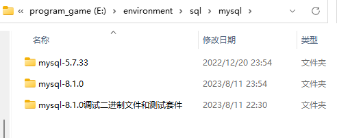

​	**3.配置my.ini  通过更改两个mysql的端口来区分数据库**

原先的mysql-5.7.33

```ini
[mysqld]
# 设置3305端口
port=3305
#设置时区为东八区，此项设置后，在连接MySQL的时候可以不用每次都手动设置时区
default-time-zone = '+8:00'
# 设置mysql的安装目录   ----------是你的文件路径-------------
basedir=E:\\environment\\sql\\mysql\\mysql-5.7.33
# 设置mysql数据库的数据的存放目录  ---------是你的文件路径data文件夹自行创建
datadir=E:\\environment\\sql\\mysql\\mysql-5.7.33\\data
# 允许最大连接数
# max_connections=200
# 允许连接失败的次数。
# max_connect_errors=10
# 服务端使用的字符集默认为utf8
character-set-server=utf8
# 创建新表时将使用的默认存储引擎
default-storage-engine=INNODB
[mysql]
# 设置mysql客户端默认字符集
default-character-set=utf8
[client]
# 设置mysql客户端连接服务端时默认使用的端口
# port=3305
default-character-set=utf8
```

刚刚解压的mysql-8.1.0,新建my.ini文件

```ini
[mysqld]
# 设置3306端口
port=3306
#设置时区为东八区，此项设置后，在连接MySQL的时候可以不用每次都手动设置时区
default-time-zone = '+8:00'
# 设置mysql的安装目录   ----------是你的文件路径-------------
basedir=E:\\environment\\sql\\mysql\\mysql-8.1.0
# 设置mysql数据库的数据的存放目录  ---------是你的文件路径data文件夹自行创建
datadir=E:\\environment\\sql\\mysql\\mysql-8.1.0\\data
# 允许最大连接数
# max_connections=200
# 允许连接失败的次数。
# max_connect_errors=10
# 服务端使用的字符集默认为utf8
character-set-server=utf8
# 创建新表时将使用的默认存储引擎
default-storage-engine=INNODB
# 默认使用mysql_native_password caching_sha2_password”插件认证 
# default_authentication_plugin=mysql_native_password 
# 解决导入脚本时funtion报错 
log_bin_trust_function_creators=1 
[mysql]
# 设置mysql客户端默认字符集
default-character-set=utf8
[client]
# 设置mysql客户端连接服务端时默认使用的端口
port=3306
default-character-set=utf8
```

> 其中的参数，了解的可自行修改。
>
> [MySQL配置文件（my.ini）详解](https://bbs.huaweicloud.com/forum/thread-99790-1-1.html)

​	4.安装mysql服务

mysql-5.7.33

因为以前有data文件，所以没有进行初始化

管理员模式cmd，进入mysql-5.7.33的bin目录下

```bash
mysqld install mysql5 --defaults-file="E:\environment\sql\mysql\mysql-5.7.33\my.ini"
```

打开mysql5服务

```bash
net start mysql5
```

测试登录

```bash
mysql -uroot -p****** -P3305
```

mysql-8.1.0

先对其进行初始化生成data文件夹		管理员模式cmd，进入mysql-8.1.0的bin目录下

```bash
mysqld  --defaults-file="E:\environment\sql\mysql\mysql-8.1.0\my.ini" --initialize-insecure
```

生成了data目录，然后创建mysql8服务

```bash
mysqld install mysql8 --defaults-file="E:\environment\sql\mysql\mysql-8.1.0\my.ini"
```

测试运行	net start mysql8

**什么？运行失败？服务启动不了？**

打开服务找到刚刚创建的mysql服务，分别查看它们的属性。

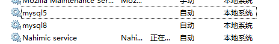

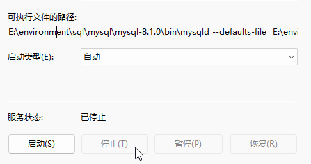

有极大的可能新安装的mysql8的可执行文件路径用的mysqld是mysql5.7的，所以我们去注册表更改信息

打开注册编辑表，找到这个路径 计算机\HKEY_LOCAL_MACHINE\SYSTEM\CurrentControlSet\Services\mysql8

修改ImagePath属性修改其mysqld的路径并刷新服务观察修改成功后，在尝试运行

**注意：运行时，因为没有配置环境变量一定要在指定路径启动服务**

​	5.运行

一般按照以上操作，mysql8登陆时是没有密码的

直接登陆进去后创建密码

```mysql
alter user 'root'@'localhost' identified by 'newPassword';
```

《不出意外》，安装成功。


## 1 mysql基础使用

​	MySQL - 免费，用的最多的，开源数据库，适用于中小型


### 1.1 数据模型


### 1.2 建库


### 1.3 数据库的规范化


### 1.4 sql语句

  

结构化查询语言（Structured Query Language）简称SQL，这是一种特殊的语言，它专门用于数据库的操作。每一种数据库都支持SQL，但是他们之间会存在一些细微的差异，因此不同的数据库都存在自己的“方言”。

SQL语句不区分大小写（关键字推荐使用大写），它支持多行，并且需要使用`;`进行结尾！

SQL也支持注释，通过使用`--`或是`#`来编写注释内容，也可以使用`/*`来进行多行注释。

我们要学习的就是以下四种类型的SQL语言：

- 数据查询语言（Data Query Language, DQL）基本结构是由SELECT子句，FROM子句，WHERE子句组成的查询块。
- 数据操纵语言（Data Manipulation Language, DML）是SQL语言中，负责对数据库对象运行数据访问工作的指令集，以INSERT、UPDATE、DELETE三种指令为核心，分别代表插入、更新与删除，是开发以数据为中心的应用程序必定会使用到的指令。
- 数据库定义语言DDL(Data Definition Language)，是用于描述数据库中要存储的现实世界实体的语言。
- DCL（Data Control Language）是数据库控制语言。是用来设置或更改数据库用户或角色权限的语句，包括（grant,deny,revoke等）语句。在默认状态下，只有sysadmin,dbcreator,db_owner或db_securityadmin等人员才有权力执行DCL。


### 1.5 DDL

数据库定义包括表的定义


#### 1.5.1 数据库操作

- 创建数据库 : `create database [if not exists] 数据库名; `

- 删除数据库 : `drop database [if exists] 数据库名; `

- 查看数据库 : `show databases; `

- 使用数据库 : `use 数据库名;`

- 创建时设定编码格式：`create database if not exists 数据库名 default char set 编码格式 collate 编码规则;`

```mysql
-- 创建数据库
create database mysql_basis;

-- 删除数据库
drop database mysql_basis;

-- 查看数据库
show databases ;

-- 返回建库语句
show create database mysql_basis;

-- 创建时设定编码格式
create database if not exists mysql_basis default char set utf8mb4 collate utf8mb4_general_ci;

-- 使用数据库
use mysql_basis;
```


#### 1.5.2 表操作

##### 创建表

数据库创建完成后，我们一般通过`create table`语句来创建一张表：

```sql
create table [if not exists] 表名(
    		 列名 数据类型[列级约束条件],
             列名 数据类型[列级约束条件],
             ...
    		 [,表级约束条件]
);
```


##### 数据字段类型

字符串存储：

| 类型       | 说明                                                         | 最大长度      |
| ---------- | ------------------------------------------------------------ | ------------- |
| char(n)    | 固定字符串，检索快但费空间，如果插入的长度小于定义长度时，则用空格填充。<br />0 <= n <= 255 | n字符         |
| varchar(n) | 可变字符串，长度不固定，但不能超过n，不会用空格填充<br />0 <= n <= 65535 | 变长度        |
| tinytext   | 微型文本串                                                   | 2^8 - 1 字节  |
| text       | 文本串                                                       | 2^16 - 1 字节 |


存储数字：

| 类型      | 说明                             | 取值范围                                                     | 存储需求 |
| --------- | -------------------------------- | ------------------------------------------------------------ | -------- |
| tinyint   | 非常小的数据                     | (-128,127) | 1字节    |
| smallint  | 较小的数据                       | (-32768，32767) | 2字节    |
| mediumint | 中等大小的数据                   |  | 3字节    |
| int       | 标准整数                         | (-2147483648，2147483647) | 4字节    |
| bigint    | 较大的整数                       | <br />(-9,223,372,036,854,775,808，9,223,372,036,854,775,807) | 8字节    |
| float     | 单精度浮点数                     |  | 4字节    |
| double    | 双精度浮点数                     |  | 8字节    |
| decimal   | 字符串形式的浮点数  不会出现误差 | decimal(m,d)                                                 | m字节    |


存储时间：

| 类型      | 说明                                     | 取值范围                                  |
| --------- | ---------------------------------------- | ----------------------------------------- |
| date      | YYYY-MM-DD，日期格式                     | 1000-01-01 ~ 9999-12-31                   |
| time      | hh:mm:ss，时间格式                       | -838-59-59 ~ 838-59-59                    |
| datetime  | YYYY-MM-DD hh:mm:ss                      | 1000-01-01 00:00:00 ~ 9999-12-31 23:59:59 |
| timestamp | YYYY-MM-DD hh:mm:ss 格式表示的**时间戳** | 197010101000000 ~ 2037年的某个时刻        |
| year      | YYYY 格式的年份值                        | 1901 ~  2155                              |

> *格林威治时间1970年01月01日00时00分00秒* ==197010101000000


##### 数据字段属性

- unsigned	            无符号的、声明该数据列不允许负数
- zerofill                     0填充的、不足位数用0来填充	  int(4)  5 == 0005
- auto_increment    自增默认+1、通常用于设置主键且为整数类型、可定义起始值和步长
- null和not null         默认空、默认不为空
- default				     默认值
- comment                 列注释


##### 表级约束条件

​	表级约束有四种：主键、外键、唯一、检查

​	现在我们通过SQL语句来创建我们之前提到的三张表。

```sql
[CONSTRAINT <外键名>] FOREIGN KEY 字段名 [，字段名2，…] REFERENCES <主表名> 主键列1 [，主键列2，…]
```


##### 数据表的类型

- innodb
- myisam
- heap
- bob
- csv

常见的innodb和myisam：

|            | myisam | innodb       |
| ---------- | ------ | ------------ |
| 事务处理   | 不支持 | 支持         |
| 数据行锁定 | 不支持 | 支持         |
| 外键约束   | 不支持 | 支持         |
| 全文检索   | 支持   | 不支持       |
| 表空间大小 | 较小   | 较大，约两倍 |


##### 数据表字符集

`CREATE TABLE 表名()CHARSET = utf8;`


##### 数据表存储位置

- MySQL数据表以文件方式存放在磁盘中 
    - 包括表文件 , 数据文件 , 以及数据库的选项文件 
    - 位置 : Mysql安装目录\data\下存放数据表 . 目录名对应数据库名 , 该目录下文件名对应数据表 . 
- 注意 :
    - InnoDB类型数据表只有一个 *.frm文件 , 以及上一级目录的ibdata1文件 
    - MyISAM类型数据表对应三个文件 : 
        - `*.frm `-- 表结构定义文件 
        - `*.MYD` -- 数据文件 ( data ) 
        - `*.MYI` -- 索引文件 ( index )

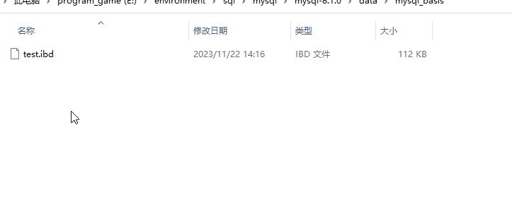

#####  修改表

如果我们想修改表结构，我们可以通过`alter table`来进行修改：

```sql
ALTER TABLE 表名[ADD 新列名 数据类型[列级约束条件]]
			    [DROP COLUMN 列名[restrict|cascade]]
                [ALTER COLUMN 列名 新数据类型]
```

我们可以添加restrict或cascade，默认是restrict，表示如果此列作为其他表的约束或视图引用到此列时，将无法删除，而cascade会强制连带引用此列的约束、视图一起删除。还可以通过ALTER来修改此列的属性。

- 修改表名 : `alter table 旧表名 rename as 新表名 `
- 添加字段 : `alter table 表名 add 字段名 列属性[属性] `
- 修改字段 : 
    - `alter table 表名 modify 字段名 列类型[属性] `
    - `alter table 表名 change 旧字段名 新字段名 列属性[属性] `
- 删除字段 : `alter table 表名 drop 字段名`


##### 删除表

我们可以通过`drop table`来删除一个表：

```sql
DROP TABLE 表名[restrict|cascade]
```

其中restrict和cascade上面的效果一致。


```mysql


-- 创建表
create table test(
    id  int ,
    create_time datetime ,
    update_time datetime,
    primary key (`id`)
);


-- 删除表
drop table test;


-- 列约束
create table test(
    id int unsigned,         -- 不能为负数
    create_time datetime not null , -- 非空
    update_time datetime not null default '2023-12-1', -- 设置默认值
    primary key (`id`),         -- 创建主键
    key `key_id` (`id`),        -- 创建外键key_id
    constraint `key_id` foreign key (`id`) references `test` (`id`) -- 给这个外键添加约束即连接其他表 （执行引用） references 引用  这里没有其他表就连自己了

);

-- 配置编码值、自增情况、数据表类型
create table test(
    id int unsigned,         -- 不能为负数
    create_time datetime not null , -- 非空
    update_time datetime not null default '2023-12-1', -- 设置默认值
    primary key (`id`)

)engine=innodb auto_increment=2 default charset=utf8mb4;


-- 查看库内的表
show tables ;

-- 查看表设计
describe test;

-- 返回创建表的语句
show create table test;

-- 修改表
-- 也可以不在表内创建外键
alter table `test` add constraint `key_test` foreign key (`id`) references `test` (`id`);

-- 增加列
alter table `test` add `name` varchar(255);

-- 改名
alter table `test` rename as `test1`;

-- 查看新表
describe test1;

-- 改字段
alter table `test1` modify `name` varchar(100);

-- 改字段并改字段名
alter table `test1` change `name` `name1` varchar(255);

-- 删除字段
alter table `test1` drop `name1`;

-- 要删除外键关系的表，必须先删除引用外键的表，再删除被引用的表  就是先删除references前的表，再删除references后的表
drop table test1;
drop table if exists test;  -- 删除前可以先判断一下
```


### 1.6 DML

数据的存储和管理，包括curd的增删改：

- insert
- update
- delete

#### 1.6.1 插入数据

插入一条数据：

`insert into 表名 values('值1','值2','值3')`

一行中单独几个列插入数据，列要有默认值：

`insert into 表名 (字段1，字段3) values(‘值1’,’值3);`

一次性向数据库中插入多条数据：

`INSERT INTO 表名(列名1, 列名2) VALUES(值1, 值2), (值1, 值2), (值1, 值2);`

```mysql
-- 插入数据
use mysql_basis;

-- 把每列都插入
insert into test values (1,'2023-09-30 12:30:00','2023-09-30 12:30:00');

select *
from test;

-- 向指定列插入数据
insert into test(id, create_time) values (2,'2023-10-30 12:30:00');

-- 一次性向数据库中插入多条数据
insert into test values (3,'2023-09-30 12:30:00','2023-09-30 12:30:00'),
                        (4,'2023-09-30 12:30:00','2023-09-30 12:30:00'),
                        (5,'2023-09-30 12:30:00','2023-09-30 12:30:00');
```


#### 1.6.2 修改数据

`update 表名 set 要更改的数据列 = 要更改的值 [,要更改的数据列2=要更改的值] where 筛选条件`

```mysql
-- 修改数据
-- update 表名 set 要更改的数据列 = 要更改的值 [,要更改的数据列2=要更改的值] where 筛选条件

update test set update_time = '2023-11-20 18:00:00' where id = 1;
```


#### 1.6.3 删除数据

> delete

删除数据

不会重新设置`auto_increment`计数器，删除数据后，新插入的数据id会在以前的数据id后面

`delete from 表名 [where condition]`


> truncate 

清空表数据，但表结构，索引，约束不变

速度过更快、不会对事务有影响、会重新设置`auto_increment`计数器

`truncate [table] table_name`


```mysql
-- 删除数据

-- delete
delete from test where true;

insert into test (create_time)
values ('2000-10-12 12:00:00');

-- truncate
truncate test;

insert into test (create_time)
values ('2000-10-12 12:00:00');
```

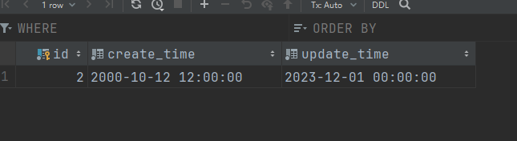

`delete`删除一条后，重新插入`id`没有重新计算，而truncate后就变为1了

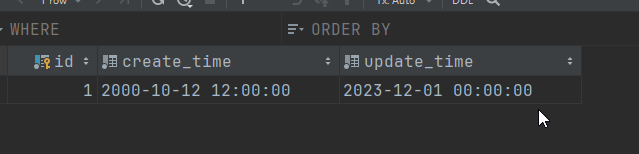


### 1.7 DQL

数据库查询

select  


### 1.8 DCL

数据库管理控制


#### 1.8.1 user

主要是用户操作  https://dev.mysql.com/doc/refman/8.2/en/user-names.html

庞大的数据库不可能由一个人来管理，我们需要更多的用户来一起管理整个数据库。

##### 创建用户

我们可以通过`create user`来创建用户：

```sql
CREATE USER 用户名 identified by 密码;
```

也可以不带密码：

```sql
CREATE USER 用户名;
```

我们可以通过@来限制用户登录的登录IP地址，`%`表示匹配所有的IP地址，默认使用的就是任意IP地址。


##### 登陆用户

首先需要添加一个环境变量，然后我们通过cmd去登陆mysql：

```sql
login -u 用户名 -p
```

输入密码后即可登陆此用户，我们输入以下命令来看看能否访问所有数据库：

```sql
show databases;
```

我们发现，虽然此用户能够成功登录，但是并不能查看完整的数据库列表，这是因为此用户还没有权限！


##### 用户授权

我们可以通过使用`grant`来为一个数据库用户进行授权：

```sql
grant all|权限1,权限2...(列1,...) on 数据库.表 to 用户 [with grant option]
```

其中all代表授予所有权限，当数据库和表为`*`，代表为所有的数据库和表都授权。如果在最后添加了`with grant option`，那么被授权的用户还能将已获得的授权继续授权给其他用户。

我们可以使用`revoke`来收回一个权限：

```sql
revoke all|权限1,权限2...(列1,...) on 数据库.表 from 用户
```


### 1.9 视图

​	视图本质就是一个查询的结果，不过我们每次都可以通过打开视图来按照我们想要的样子查看数据。既然视图本质就是一个查询的结果，那么它本身就是一个虚表，并不是真实存在的，数据实际上还是存放在原来的表中。


视图本质就是一个查询的结果，不过我们每次都可以通过打开视图来按照我们想要的样子查看数据。既然视图本质就是一个查询的结果，那么它本身就是一个虚表，并不是真实存在的，数据实际上还是存放在原来的表中。

我们可以通过`create view`来创建视图;

```sql
CREATE VIEW 视图名称(列名) as 子查询语句 [WITH CHECK OPTION];
```

WITH CHECK OPTION是指当创建后，如果更新视图中的数据，是否要满足子查询中的条件表达式，不满足将无法插入，创建后，我们就可以使用`select`语句来直接查询视图上的数据了，因此，还能在视图的基础上，导出其他的视图。

1. 若视图是由两个以上基本表导出的，则此视图不允许更新。
2. 若视图的字段来自字段表达式或常数，则不允许对此视图执行INSERT和UPDATE操作，但允许执行DELETE操作。
3. 若视图的字段来自集函数，则此视图不允许更新。
4. 若视图定义中含有GROUP BY子句，则此视图不允许更新。
5. 若视图定义中含有DISTINCT短语，则此视图不允许更新。
6. 若视图定义中有嵌套查询，并且内层查询的FROM子句中涉及的表也是导出该视图的基本表，则此视图不允许更新。例如将成绩在平均成绩之上的元组定义成一个视图GOOD_SC： CREATE VIEW GOOD_SC AS SELECT Sno, Cno, Grade FROM SC WHERE Grade > (SELECT AVG(Grade) FROM SC); 　　导出视图GOOD_SC的基本表是SC，内层查询中涉及的表也是SC，所以视图GOOD_SC是不允许更新的。
7. 一个不允许更新的视图上定义的视图也不允许更新

通过`drop`来删除一个视图：

```sql
drop view apptest
```


### 1.10索引


### 1.11 触发器


### 1.12 事务


### 1.13 函数


### 1.14 存储过程


## 2 了解mysql

官网：https://www.mysql.com/

官方文档：https://dev.mysql.com/doc/refman/


### 2.1 MySQL数据目录

MySQL 服务器管理的信息存储在称为数据目录的目录下：

- 数据目录子目录。数据目录的每个子目录都是一个数据库目录，对应于服务器管理的一个数据库。所有 MySQL 安装都有某些标准数据库：

    - 该`mysql`目录对应于 `mysql`系统架构，其中包含 MySQL 服务器运行时所需的信息。该数据库包含数据字典表和系统表。有关系统的可以查询的表都在其中，而其他数据库都存的是视图。
    - 该`performance_schema`目录对应于 Performance Schema，它提供了用于在运行时检查服务器内部执行情况的信息。
    - 该`sys`目录对应于 `sys`schema，它提供了一组对象来帮助更轻松地解释 Performance Schema 信息。
    - 该`ndbinfo`目录对应于`ndbinfo`存储特定于 NDB Cluster 的信息的数据库（仅适用于包含 NDB Cluster 的安装）。

    其他子目录对应于用户或应用程序创建的数据库。

    > 笔记

    [`INFORMATION_SCHEMA`](https://dev.mysql.com/doc/refman/8.2/en/information-schema.html)是一个标准数据库，但其实现没有使用相应的数据库目录。

- 服务器写入的日志文件。请参见 [第 5.4 节“MySQL 服务器日志”](https://dev.mysql.com/doc/refman/8.2/en/server-logs.html)。

- `InnoDB`表空间和日志文件。请参阅 [第 15 章，*InnoDB 存储引擎*](https://dev.mysql.com/doc/refman/8.2/en/innodb-storage-engine.html)。

- 默认/自动生成的 SSL 和 RSA 证书和密钥文件。请参阅[第 6.3.3 节“创建 SSL 和 RSA 证书和密钥”](https://dev.mysql.com/doc/refman/8.2/en/creating-ssl-rsa-files.html)。

- 服务器进程 ID 文件（当服务器运行时）。

- `mysqld-auto.cnf`存储持久的全局系统变量设置的文件 。请参见 [第 13.7.6.1 节“变量赋值的 SET 语法”](https://dev.mysql.com/doc/refman/8.2/en/set-variable.html)。

通过重新配置服务器，可以将前面列表中的某些项目重新定位到其他位置。此外，该 [`--datadir`](https://dev.mysql.com/doc/refman/8.2/en/server-system-variables.html#sysvar_datadir)选项还可以更改数据目录本身的位置。对于给定的 MySQL 安装，检查服务器配置以确定项目是否已移动。


### 2.2 MySQL系统架构

- [Data Dictionary Tables](https://dev.mysql.com/doc/refman/8.2/en/system-schema.html#system-schema-data-dictionary-tables)	数据字典表
- [Grant System Tables](https://dev.mysql.com/doc/refman/8.2/en/system-schema.html#system-schema-grant-tables)    授权系统表
- [Object Information System Tables ](https://dev.mysql.com/doc/refman/8.2/en/system-schema.html#system-schema-object-tables)   对象信息系统表
- [Log System Tables ](https://dev.mysql.com/doc/refman/8.2/en/system-schema.html#system-schema-log-tables)   日志系统表
- [Server-Side Help System Tables ](https://dev.mysql.com/doc/refman/8.2/en/system-schema.html#system-schema-help-tables)   服务器端帮助系统表
- [Time Zone System Tables ](https://dev.mysql.com/doc/refman/8.2/en/system-schema.html#system-schema-time-zone-tables)   时区系统表
- [Replication System Tables](https://dev.mysql.com/doc/refman/8.2/en/system-schema.html#system-schema-replication-tables)    复制系统表
- [Optimizer System Tables ](https://dev.mysql.com/doc/refman/8.2/en/system-schema.html#system-schema-optimizer-tables)   优化器系统表
- [Miscellaneous System Tables ](https://dev.mysql.com/doc/refman/8.2/en/system-schema.html#system-schema-miscellaneous-tables)   杂项系统表

#### 2.2.1 Data Dictionary Tables

这些表组成了数据字典，其中包含有关数据库对象的元数据：

- `catalogs`：目录信息。
- `character_sets`：有关可用字符集的信息。
- `check_constraints`：有关 `CHECK`表上定义的约束的信息。请参见 [第 13.1.20.6 节“检查约束”](https://dev.mysql.com/doc/refman/8.2/en/create-table-check-constraints.html)。
- `collations`：有关每个字符集的排序规则的信息。
- `column_statistics`：列值的直方图统计。请参见 [第 8.9.6 节“优化器统计信息”](https://dev.mysql.com/doc/refman/8.2/en/optimizer-statistics.html)。
- `column_type_elements`：有关列使用的类型的信息。
- `columns`：有关表中列的信息。
- `dd_properties`：标识数据字典属性（例如版本）的表。服务器使用它来确定数据字典是否必须升级到较新的版本。
- `events`：有关事件调度程序事件的信息。请参见[第 25.4 节“使用事件调度程序”](https://dev.mysql.com/doc/refman/8.2/en/event-scheduler.html)。如果使用该选项启动服务器 [`--skip-grant-tables`](https://dev.mysql.com/doc/refman/8.2/en/server-options.html#option_mysqld_skip-grant-tables)，则事件调度程序将被禁用，并且表中注册的事件不会运行。请参见 [第 25.4.2 节“事件调度程序配置”](https://dev.mysql.com/doc/refman/8.2/en/events-configuration.html)。
- `foreign_keys`, `foreign_key_column_usage`：有关外键的信息。
- `index_column_usage`：有关索引使用的列的信息。
- `index_partitions`：有关索引使用的分区的信息。
- `index_stats`：用于存储[`ANALYZE TABLE`](https://dev.mysql.com/doc/refman/8.2/en/analyze-table.html)执行时产生的动态索引统计信息。
- `indexes`：有关表索引的信息。
- `innodb_ddl_log`：存储 DDL 日志以确保崩溃安全的 DDL 操作。
- `parameter_type_elements`：有关存储过程和函数参数以及有关存储函数的返回值的信息。
- `parameters`：有关存储过程和函数的信息。请参见 [第 25.2 节“使用存储的例程”](https://dev.mysql.com/doc/refman/8.2/en/stored-routines.html)。
- `resource_groups`：有关资源组的信息。请参见[第 5.1.16 节“资源组”](https://dev.mysql.com/doc/refman/8.2/en/resource-groups.html)。
- `routines`：有关存储过程和函数的信息。请参见 [第 25.2 节“使用存储的例程”](https://dev.mysql.com/doc/refman/8.2/en/stored-routines.html)。
- `schemata`：有关架构的信息。在 MySQL 中，模式就是数据库，因此该表提供有关数据库的信息。
- `st_spatial_reference_systems`：有关空间数据的可用空间参考系统的信息。
- `table_partition_values`：有关表分区使用的值的信息。
- `table_partitions`：有关表使用的分区的信息。
- `table_stats`[`ANALYZE TABLE`](https://dev.mysql.com/doc/refman/8.2/en/analyze-table.html)：执行 时产生的动态表统计信息。
- `tables`：有关数据库中表的信息。
- `tablespace_files`：有关表空间使用的文件的信息。
- `tablespaces`：有关活动表空间的信息。
- `triggers`：有关触发器的信息。
- `view_routine_usage`：有关视图及其使用的存储函数之间的依赖关系的信息。
- `view_table_usage`：用于跟踪视图及其基础表之间的依赖关系。

数据字典表是不可见的。它们无法用 读取 [`SELECT`](https://dev.mysql.com/doc/refman/8.2/en/select.html)、不会出现在 的输出中[`SHOW TABLES`](https://dev.mysql.com/doc/refman/8.2/en/show-tables.html)、未在`INFORMATION_SCHEMA.TABLES` 表中列出，等等。不过大多数情况下都有对应的`INFORMATION_SCHEMA`表可以查询。从概念上讲， `INFORMATION_SCHEMA`MySQL 提供了一个视图来公开数据字典元数据。例如，您不能`mysql.schemata`直接从表中选择：

```sql
mysql> SELECT * FROM mysql.schemata;
ERROR 3554 (HY000): Access to data dictionary table 'mysql.schemata' is rejected.
```

相反，从相应的 `INFORMATION_SCHEMA`表中选择该信息：

```sql
SELECT * FROM INFORMATION_SCHEMA.SCHEMATA;
```

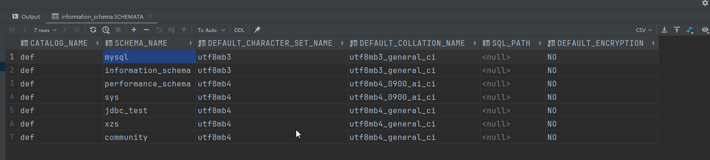


没有与 完全对应 `mysql.indexes`但 [`INFORMATION_SCHEMA.STATISTICS`](https://dev.mysql.com/doc/refman/8.2/en/information-schema-statistics-table.html) 包含许多相同信息的信息模式表。

到目前为止，还没有与 ,完全`INFORMATION_SCHEMA` 对应的表 `mysql.foreign_keys`。 `mysql.foreign_key_column_usage`获取外键信息的标准 SQL 方式是使用 `INFORMATION_SCHEMA` [`REFERENTIAL_CONSTRAINTS`](https://dev.mysql.com/doc/refman/8.2/en/information-schema-referential-constraints-table.html)和 [`KEY_COLUMN_USAGE`](https://dev.mysql.com/doc/refman/8.2/en/information-schema-key-column-usage-table.html)表；`foreign_keys`这些表现在作为、 和其他数据字典表的视图来实现 `foreign_key_column_usage`。


#### 2.2.2 Grant System Tables

这些系统表包含有关用户帐户及其所拥有的权限的授权信息。有关这些表的结构、内容和用途的更多信息，请参阅[第 6.2.3 节“授权表”](https://dev.mysql.com/doc/refman/8.2/en/grant-tables.html)。

MySQL 8.2 授权表是 [`InnoDB`](https://dev.mysql.com/doc/refman/8.2/en/innodb-storage-engine.html)（事务）表。帐户管理语句是事务性的，要么对所有指定用户成功，要么在发生任何错误时回滚并且无效。

这些表在MySQL库可以直接查看

- `user`：用户帐户、全局权限和其他非权限列。

- 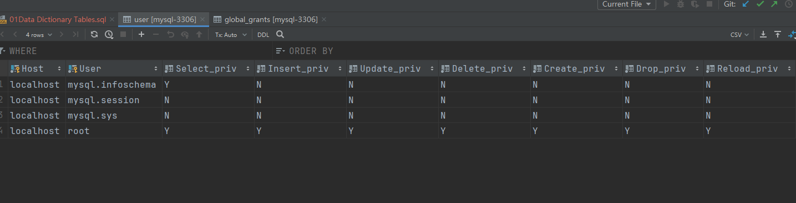

- `global_grants`：为用户分配[动态全局权限](#98.1.2 动态权限)；

- 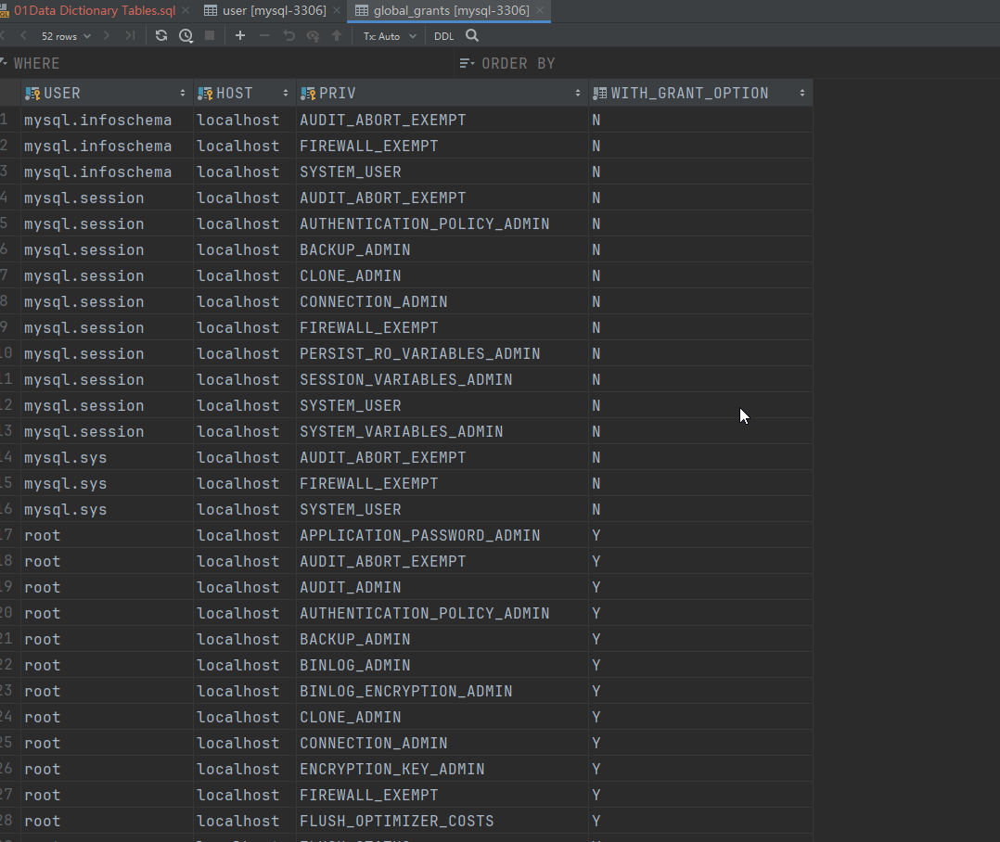

- `db`：数据库级权限。

- `tables_priv`：表级权限。

- `columns_priv`：列级权限。

- `procs_priv`：存储过程和函数权限。

- `proxies_priv`：代理用户权限。

- `default_roles`：此表列出了用户连接并验证或执行后要激活的默认角色 [`SET ROLE DEFAULT`](https://dev.mysql.com/doc/refman/8.2/en/set-role.html)。

- `role_edges`：此表列出了角色子图的边。

    给定的`user`表行可能指用户帐户或角色。`role_edges`服务器可以通过查询表中有关身份验证 ID 之间关系的信息来 区分一行是否代表用户帐户、角色或两者。

- `password_history`：有关密码更改的信息。


#### 2.2.3 Object Information System Tables 


- component    使用安装的服务器组件的注册表[`INSTALL COMPONENT`](https://dev.mysql.com/doc/refman/8.2/en/install-component.html)。此表中列出的任何组件均由加载程序服务在服务器启动序列期间安装。
- 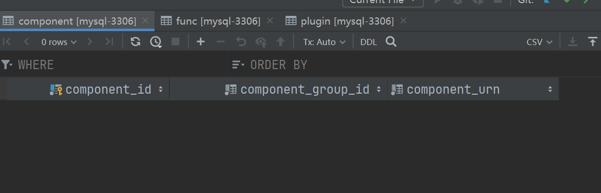
- func
- 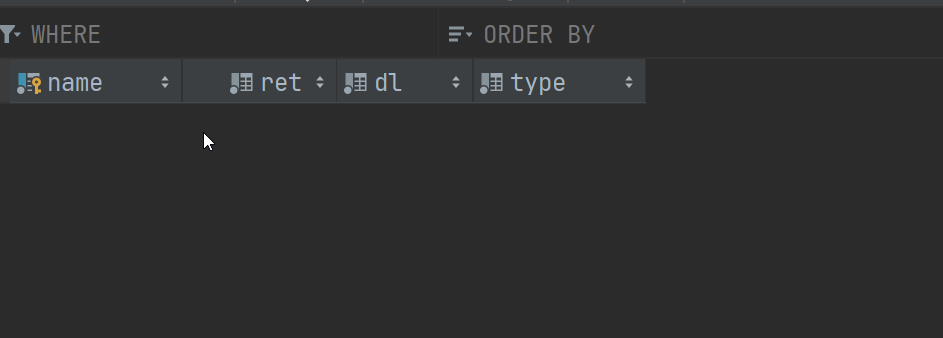
- plugin
- 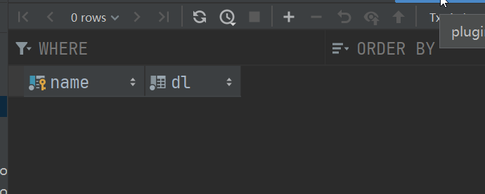


#### 2.2.4 Log System Tables


#### 2.2.5 Server-Side Help System Tables


#### 2.2.6 Time Zone System Tables


#### 2.2.7 Replication System Tables


#### 2.2.8 Optimizer System Tables


#### 2.2.9 Miscellaneous System Tables


- [Log System Tables ](https://dev.mysql.com/doc/refman/8.2/en/system-schema.html#system-schema-log-tables)   日志系统表
- [Server-Side Help System Tables ](https://dev.mysql.com/doc/refman/8.2/en/system-schema.html#system-schema-help-tables)   服务器端帮助系统表
- [Time Zone System Tables ](https://dev.mysql.com/doc/refman/8.2/en/system-schema.html#system-schema-time-zone-tables)   时区系统表
- [Replication System Tables](https://dev.mysql.com/doc/refman/8.2/en/system-schema.html#system-schema-replication-tables)    复制系统表
- [Optimizer System Tables ](https://dev.mysql.com/doc/refman/8.2/en/system-schema.html#system-schema-optimizer-tables)   优化器系统表
- [Miscellaneous System Tables ](https://dev.mysql.com/doc/refman/8.2/en/system-schema.html#system-schema-miscellaneous-tables)   杂项系统表

### 2.3 MySQL组件


## 3 MySQL进阶


## 98 附录

### 98.1 权限


#### 98.1.1 静态权限

下表显示了 [`GRANT`](https://dev.mysql.com/doc/refman/8.2/en/grant.html)和 [`REVOKE`](https://dev.mysql.com/doc/refman/8.2/en/revoke.html)语句中使用的静态权限名称，以及与授权表中每个权限关联的列名称以及该权限应用的上下文。

表 6.2 GRANT 和 REVOKE 允许的静态权限

| 特权                                                         | 授予表列                 | 语境                   |
| :----------------------------------------------------------- | :----------------------- | :--------------------- |
| [`ALL [PRIVILEGES\]`](https://dev.mysql.com/doc/refman/8.2/en/privileges-provided.html#priv_all) | “所有特权”的同义词       | 服务器管理             |
| [`ALTER`](https://dev.mysql.com/doc/refman/8.2/en/privileges-provided.html#priv_alter) | `Alter_priv`             | 表格                   |
| [`ALTER ROUTINE`](https://dev.mysql.com/doc/refman/8.2/en/privileges-provided.html#priv_alter-routine) | `Alter_routine_priv`     | 存储的例程             |
| [`CREATE`](https://dev.mysql.com/doc/refman/8.2/en/privileges-provided.html#priv_create) | `Create_priv`            | 数据库、表或索引       |
| [`CREATE ROLE`](https://dev.mysql.com/doc/refman/8.2/en/privileges-provided.html#priv_create-role) | `Create_role_priv`       | 服务器管理             |
| [`CREATE ROUTINE`](https://dev.mysql.com/doc/refman/8.2/en/privileges-provided.html#priv_create-routine) | `Create_routine_priv`    | 存储的例程             |
| [`CREATE TABLESPACE`](https://dev.mysql.com/doc/refman/8.2/en/privileges-provided.html#priv_create-tablespace) | `Create_tablespace_priv` | 服务器管理             |
| [`CREATE TEMPORARY TABLES`](https://dev.mysql.com/doc/refman/8.2/en/privileges-provided.html#priv_create-temporary-tables) | `Create_tmp_table_priv`  | 表格                   |
| [`CREATE USER`](https://dev.mysql.com/doc/refman/8.2/en/privileges-provided.html#priv_create-user) | `Create_user_priv`       | 服务器管理             |
| [`CREATE VIEW`](https://dev.mysql.com/doc/refman/8.2/en/privileges-provided.html#priv_create-view) | `Create_view_priv`       | 意见                   |
| [`DELETE`](https://dev.mysql.com/doc/refman/8.2/en/privileges-provided.html#priv_delete) | `Delete_priv`            | 表格                   |
| [`DROP`](https://dev.mysql.com/doc/refman/8.2/en/privileges-provided.html#priv_drop) | `Drop_priv`              | 数据库、表或视图       |
| [`DROP ROLE`](https://dev.mysql.com/doc/refman/8.2/en/privileges-provided.html#priv_drop-role) | `Drop_role_priv`         | 服务器管理             |
| [`EVENT`](https://dev.mysql.com/doc/refman/8.2/en/privileges-provided.html#priv_event) | `Event_priv`             | 数据库                 |
| [`EXECUTE`](https://dev.mysql.com/doc/refman/8.2/en/privileges-provided.html#priv_execute) | `Execute_priv`           | 存储的例程             |
| [`FILE`](https://dev.mysql.com/doc/refman/8.2/en/privileges-provided.html#priv_file) | `File_priv`              | 服务器主机上的文件访问 |
| [`GRANT OPTION`](https://dev.mysql.com/doc/refman/8.2/en/privileges-provided.html#priv_grant-option) | `Grant_priv`             | 数据库、表或存储例程   |
| [`INDEX`](https://dev.mysql.com/doc/refman/8.2/en/privileges-provided.html#priv_index) | `Index_priv`             | 表格                   |
| [`INSERT`](https://dev.mysql.com/doc/refman/8.2/en/privileges-provided.html#priv_insert) | `Insert_priv`            | 表或列                 |
| [`LOCK TABLES`](https://dev.mysql.com/doc/refman/8.2/en/privileges-provided.html#priv_lock-tables) | `Lock_tables_priv`       | 数据库                 |
| [`PROCESS`](https://dev.mysql.com/doc/refman/8.2/en/privileges-provided.html#priv_process) | `Process_priv`           | 服务器管理             |
| [`PROXY`](https://dev.mysql.com/doc/refman/8.2/en/privileges-provided.html#priv_proxy) | 见表`proxies_priv`_      | 服务器管理             |
| [`REFERENCES`](https://dev.mysql.com/doc/refman/8.2/en/privileges-provided.html#priv_references) | `References_priv`        | 数据库或表             |
| [`RELOAD`](https://dev.mysql.com/doc/refman/8.2/en/privileges-provided.html#priv_reload) | `Reload_priv`            | 服务器管理             |
| [`REPLICATION CLIENT`](https://dev.mysql.com/doc/refman/8.2/en/privileges-provided.html#priv_replication-client) | `Repl_client_priv`       | 服务器管理             |
| [`REPLICATION SLAVE`](https://dev.mysql.com/doc/refman/8.2/en/privileges-provided.html#priv_replication-slave) | `Repl_slave_priv`        | 服务器管理             |
| [`SELECT`](https://dev.mysql.com/doc/refman/8.2/en/privileges-provided.html#priv_select) | `Select_priv`            | 表或列                 |
| [`SHOW DATABASES`](https://dev.mysql.com/doc/refman/8.2/en/privileges-provided.html#priv_show-databases) | `Show_db_priv`           | 服务器管理             |
| [`SHOW VIEW`](https://dev.mysql.com/doc/refman/8.2/en/privileges-provided.html#priv_show-view) | `Show_view_priv`         | 意见                   |
| [`SHUTDOWN`](https://dev.mysql.com/doc/refman/8.2/en/privileges-provided.html#priv_shutdown) | `Shutdown_priv`          | 服务器管理             |
| [`SUPER`](https://dev.mysql.com/doc/refman/8.2/en/privileges-provided.html#priv_super) | `Super_priv`             | 服务器管理             |
| [`TRIGGER`](https://dev.mysql.com/doc/refman/8.2/en/privileges-provided.html#priv_trigger) | `Trigger_priv`           | 表格                   |
| [`UPDATE`](https://dev.mysql.com/doc/refman/8.2/en/privileges-provided.html#priv_update) | `Update_priv`            | 表或列                 |
| [`USAGE`](https://dev.mysql.com/doc/refman/8.2/en/privileges-provided.html#priv_usage) | “没有特权”的同义词       | 服务器管理             |


#### 98.1.2 动态权限

[`GRANT`](https://dev.mysql.com/doc/refman/8.2/en/grant.html)下表显示了和 语句 中使用的动态权限名称 [`REVOKE`](https://dev.mysql.com/doc/refman/8.2/en/revoke.html)，以及该权限应用的上下文。

**表 6.3 GRANT 和 REVOKE 允许的动态权限**

| 特权                                                         | 语境                                 |
| :----------------------------------------------------------- | :----------------------------------- |
| [`APPLICATION_PASSWORD_ADMIN`](https://dev.mysql.com/doc/refman/8.2/en/privileges-provided.html#priv_application-password-admin) | 双密码管理                           |
| [`AUDIT_ABORT_EXEMPT`](https://dev.mysql.com/doc/refman/8.2/en/privileges-provided.html#priv_audit-abort-exempt) | 允许审核日志过滤器阻止的查询         |
| [`AUDIT_ADMIN`](https://dev.mysql.com/doc/refman/8.2/en/privileges-provided.html#priv_audit-admin) | 审核日志管理                         |
| [`AUTHENTICATION_POLICY_ADMIN`](https://dev.mysql.com/doc/refman/8.2/en/privileges-provided.html#priv_authentication-policy-admin) | 认证管理                             |
| [`BACKUP_ADMIN`](https://dev.mysql.com/doc/refman/8.2/en/privileges-provided.html#priv_backup-admin) | 备份管理                             |
| [`BINLOG_ADMIN`](https://dev.mysql.com/doc/refman/8.2/en/privileges-provided.html#priv_binlog-admin) | 备份和复制管理                       |
| [`BINLOG_ENCRYPTION_ADMIN`](https://dev.mysql.com/doc/refman/8.2/en/privileges-provided.html#priv_binlog-encryption-admin) | 备份和复制管理                       |
| [`CLONE_ADMIN`](https://dev.mysql.com/doc/refman/8.2/en/privileges-provided.html#priv_clone-admin) | 克隆管理                             |
| [`CONNECTION_ADMIN`](https://dev.mysql.com/doc/refman/8.2/en/privileges-provided.html#priv_connection-admin) | 服务器管理                           |
| [`ENCRYPTION_KEY_ADMIN`](https://dev.mysql.com/doc/refman/8.2/en/privileges-provided.html#priv_encryption-key-admin) | 服务器管理                           |
| [`FIREWALL_ADMIN`](https://dev.mysql.com/doc/refman/8.2/en/privileges-provided.html#priv_firewall-admin) | 防火墙管理                           |
| [`FIREWALL_EXEMPT`](https://dev.mysql.com/doc/refman/8.2/en/privileges-provided.html#priv_firewall-exempt) | 防火墙管理                           |
| [`FIREWALL_USER`](https://dev.mysql.com/doc/refman/8.2/en/privileges-provided.html#priv_firewall-user) | 防火墙管理                           |
| [`FLUSH_OPTIMIZER_COSTS`](https://dev.mysql.com/doc/refman/8.2/en/privileges-provided.html#priv_flush-optimizer-costs) | 服务器管理                           |
| [`FLUSH_STATUS`](https://dev.mysql.com/doc/refman/8.2/en/privileges-provided.html#priv_flush-status) | 服务器管理                           |
| [`FLUSH_TABLES`](https://dev.mysql.com/doc/refman/8.2/en/privileges-provided.html#priv_flush-tables) | 服务器管理                           |
| [`FLUSH_USER_RESOURCES`](https://dev.mysql.com/doc/refman/8.2/en/privileges-provided.html#priv_flush-user-resources) | 服务器管理                           |
| [`GROUP_REPLICATION_ADMIN`](https://dev.mysql.com/doc/refman/8.2/en/privileges-provided.html#priv_group-replication-admin) | 复制管理                             |
| [`GROUP_REPLICATION_STREAM`](https://dev.mysql.com/doc/refman/8.2/en/privileges-provided.html#priv_group-replication-stream) | 复制管理                             |
| [`INNODB_REDO_LOG_ARCHIVE`](https://dev.mysql.com/doc/refman/8.2/en/privileges-provided.html#priv_innodb-redo-log-archive) | 重做日志归档管理                     |
| [`INNODB_REDO_LOG_ENABLE`](https://dev.mysql.com/doc/refman/8.2/en/privileges-provided.html#priv_innodb-redo-log-enable) | 重做日志管理                         |
| [`MASKING_DICTIONARIES_ADMIN`](https://dev.mysql.com/doc/refman/8.2/en/privileges-provided.html#priv_masking-dictionaries-admin) | 服务器管理                           |
| [`NDB_STORED_USER`](https://dev.mysql.com/doc/refman/8.2/en/privileges-provided.html#priv_ndb-stored-user) | 新开发银行集群                       |
| [`PASSWORDLESS_USER_ADMIN`](https://dev.mysql.com/doc/refman/8.2/en/privileges-provided.html#priv_passwordless-user-admin) | 认证管理                             |
| [`PERSIST_RO_VARIABLES_ADMIN`](https://dev.mysql.com/doc/refman/8.2/en/privileges-provided.html#priv_persist-ro-variables-admin) | 服务器管理                           |
| [`REPLICATION_APPLIER`](https://dev.mysql.com/doc/refman/8.2/en/privileges-provided.html#priv_replication-applier) | `PRIVILEGE_CHECKS_USER`对于复制通道  |
| [`REPLICATION_SLAVE_ADMIN`](https://dev.mysql.com/doc/refman/8.2/en/privileges-provided.html#priv_replication-slave-admin) | 复制管理                             |
| [`RESOURCE_GROUP_ADMIN`](https://dev.mysql.com/doc/refman/8.2/en/privileges-provided.html#priv_resource-group-admin) | 资源组管理                           |
| [`RESOURCE_GROUP_USER`](https://dev.mysql.com/doc/refman/8.2/en/privileges-provided.html#priv_resource-group-user) | 资源组管理                           |
| [`ROLE_ADMIN`](https://dev.mysql.com/doc/refman/8.2/en/privileges-provided.html#priv_role-admin) | 服务器管理                           |
| [`SENSITIVE_VARIABLES_OBSERVER`](https://dev.mysql.com/doc/refman/8.2/en/privileges-provided.html#priv_sensitive-variables-observer) | 服务器管理                           |
| [`SESSION_VARIABLES_ADMIN`](https://dev.mysql.com/doc/refman/8.2/en/privileges-provided.html#priv_session-variables-admin) | 服务器管理                           |
| [`SET_USER_ID`](https://dev.mysql.com/doc/refman/8.2/en/privileges-provided.html#priv_set-user-id) | 服务器管理                           |
| [`SHOW_ROUTINE`](https://dev.mysql.com/doc/refman/8.2/en/privileges-provided.html#priv_show-routine) | 服务器管理                           |
| [`SKIP_QUERY_REWRITE`](https://dev.mysql.com/doc/refman/8.2/en/privileges-provided.html#priv_skip-query-rewrite) | 服务器管理                           |
| [`SYSTEM_USER`](https://dev.mysql.com/doc/refman/8.2/en/privileges-provided.html#priv_system-user) | 服务器管理                           |
| [`SYSTEM_VARIABLES_ADMIN`](https://dev.mysql.com/doc/refman/8.2/en/privileges-provided.html#priv_system-variables-admin) | 服务器管理                           |
| [`TABLE_ENCRYPTION_ADMIN`](https://dev.mysql.com/doc/refman/8.2/en/privileges-provided.html#priv_table-encryption-admin) | 服务器管理                           |
| [`TELEMETRY_LOG_ADMIN`](https://dev.mysql.com/doc/refman/8.2/en/privileges-provided.html#priv_telemetry-log-admin) | AWS 上 MySQL HeatWave 的遥测日志管理 |
| [`TP_CONNECTION_ADMIN`](https://dev.mysql.com/doc/refman/8.2/en/privileges-provided.html#priv_tp-connection-admin) | 线程池管理                           |
| [`VERSION_TOKEN_ADMIN`](https://dev.mysql.com/doc/refman/8.2/en/privileges-provided.html#priv_version-token-admin) | 服务器管理                           |
| [`XA_RECOVER_ADMIN`](https://dev.mysql.com/doc/refman/8.2/en/privileges-provided.html#priv_xa-recover-admin) | 服务器管理                           |


### 98.2 编码


## 99 mysql数据库设计规范


### 99.0 规范


1. 用反引号（`）为标识符（库名、表名、字段名、索引、别名）包裹，以避免与关键字重名！中文 也可以作为标识符！ 
2. 每个库目录存在一个保存当前数据库的选项文件db.opt。 
3. 注释： 
    1. 单行注释 # 注释内容 
    2. 多行注释 /* 注释内容 */ 
    3. **单行注释 -- 注释内容** (标准SQL注释风格，要求双破折号后加一空格符（空格、TAB、 换行等）) 
4. 模式通配符： _ 任意单个字符 % 任意多个字符，甚至包括零字符 单引号需要进行转义 \' 
5. CMD命令行内的语句结束符可以为 ";", "\G", "\g"，仅影响显示结果。其他地方还是用分号结 束。delimiter 可修改当前对话的语句结束符。 
6. SQL对大小写不敏感 （关键字）


### 99.1 库


#### 库的命名

​	与应用名称尽量一致


### 99.2 建表

用反引号（`）为标识符（库名、表名、字段名、索引、别名）包裹，以避免与关键字重名！中文 也可以作为标识符！ 

每个库目录存在一个保存当前数据库的选项文件db.opt。 3. 注释： 单行注释 # 注释内容 多行注释 /* 注释内容 */ 单行注释 -- 注释内容 (标准SQL注释风格，要求双破折号后加一空格符（空格、TAB、 换行等）) 4. 模式通配符： _ 任意单个字符 % 任意多个字符，甚至包括零字符 单引号需要进行转义 \' 5. CMD命令行内的语句结束符可以为 ";", "\G", "\g"，仅影响显示结果。其他地方还是用分号结 束。delimiter 可修改当前对话的语句结束符。 6. SQL对大小写不敏感 （关键字）


#### 表名、字段名

起名一定要慎重，因为不能预发布

- 必须要用小写字母和数字，且数字不能开头
- 表名不能使用复数名词，就是英文后+s。单数形式符合表达习惯
- 禁用保留字
- 遵循“业务名称_ 表的作用”原则


#### 表必备三字段

- id
- create_time
- update_time


#### is_xxx

​	表达是与否概念的字段  数据类型是**unsigned** 、**tinyint**

> 如果字段是非负数，那必须是**unsigned**类型


#### 小数 decimal

​	小数类型为decimal，禁止使用float、double

在存储时，float、double类型存在精度损失的问题。如果存储的数据范围超过decimal的范围，那么建议将数据拆成整数和小数并分开存储


#### char

​	如果存储的字符串长度几乎相等，就用char 固定长度


#### varchar

​	可变长字符串，不预先分配存储空间，长度不要超过5000个字符，如果存储长度大于此值，则应定义字段类型为text，独立出来一张表，用主键来对应，避免影响其他字段的索引效率


#### 合适的字符存储长度

​	


#### 及时更新字段注释

​	当修改字段含义或追加字段表示的状态时，需要及时更新字段注释


#### 字段适当冗余

就是说：对于某一字段在多个表中出现的，就是字段冗余

​	

#### 分库分表

​	当单行表行数超过500万或单表容量超过2GB时，才推荐分库分表

如果三年后的数据无法到达这个级别，请不要创建表时分库分表


### 99.2 索引


### 99.3 sql语句


### 99.4 ORM映射


