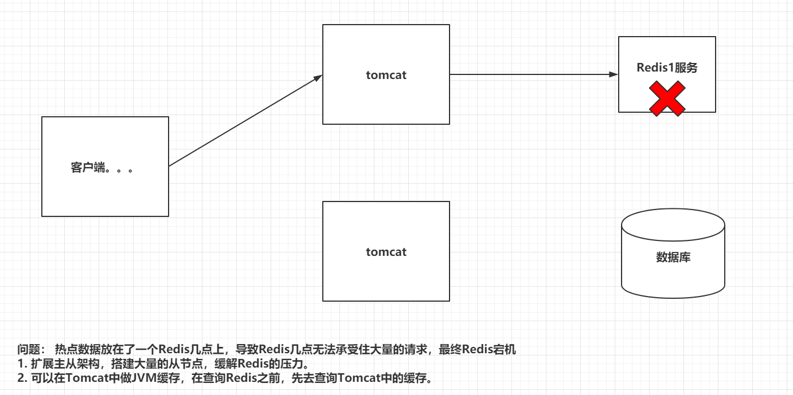

> Author：zhaojian
>
> Version：9.0.1


[TOC]


### 一、引言

----

#### 1.1 数据库压力过大

> 由于用户量增大，请求数量也随之增大，数据压力过大


#### 1.2 传统锁失效

> 多台服务器之间的锁，已经不存在互斥性了。


### 二、Redis介绍

-----

#### 2.1 NoSQL介绍

> - Redis就是一款NoSQL。
>
> - NoSQL -> 非关系型数据库 -> Not Only SQL。
>  - Key-Value：Redis。。。
>   - 文档型：ElasticSearch，Solr，Mongodb。。。
>   - 面向列：Hbase，Cassandra。。。
>   - 图形化：Neo4j。。。
> - 除了关系型数据库都是非关系型数据库。
>
> - NoSQL只是一种概念，泛指非关系型数据库，和关系型数据库做一个区分。


#### 2.2 Redis介绍

> - 有一位意大利人，在开发一款LLOOGG的统计页面，因为MySQL的性能不好，自己研发了一款非关系型数据库，并命名为Redis。Salvatore。
>
> - Redis（Remote Dictionary Server）即远程字典服务，Redis是由C语言去编写，Redis是一款基于Key-Value的NoSQL，而且Redis是基于内存存储数据的，Redis还提供了多种持久化机制，性能可以达到110000/s读取数据以及81000/s写入数据，Redis还提供了主从，哨兵以及集群的搭建方式，可以更方便的横向扩展以及垂直扩展。

|                  Redis之父                   |
| :------------------------------------------: |
|  |


### 三、Redis安装

----

#### 3.1 安装Redis

> Docker-Compose安装

```yml
version: '3.1'
services:
  redis:
    image: daocloud.io/library/redis:5.0.7
    restart: always
    container_name: redis
    environment:
      - TZ=Asia/Shanghai
    ports:
      - 6379:6379
```

#### 3.2 使用redis-cli连接Redis

> 进去Redis容器的内部
>
> docker exec -it 容器id bash
>
> 在容器内部，使用redis-cli连接

|                   链接效果                   |
| :------------------------------------------: |
|  |


#### 3.3 使用图形化界面连接Redis 

> 下载地址：https://github.com/lework/RedisDesktopManager-Windows/releases/download/2019.5/redis-desktop-manager-2019.5.zip
>
> 傻瓜式安装

|             RedisDesktopManager              |
| :------------------------------------------: |
|  |


### 四、Redis常用命令【`重点`】

---

#### 4.1 Redis存储数据的结构

> 常用的5种数据结构：
>
> - key-string：一个key对应一个值。  Map<String, string>
> - key-hash：一个key对应一个Map。 Map<String, Map<String, object>>
> - key-list：一个key对应一个列表。   Map<String, List<Object>>
> - key-set：一个key对应一个集合。 Map<String, Set<Object>>
> - key-zset：一个key对应一个有序的集合。Map<String, 可以排序的set<Object>>
>
> 另外三种数据结构：
>
> - HyperLogLog：计算近似值的。
> - GEO：地理位置。
> - BIT：一般存储的也是一个字符串，存储的是一个byte[]。

|           五种常用的存储数据结构图           |
| :------------------------------------------: |
|  |

> - key-string：最常用的，一般用于存储一个值。
>
> - key-hash：存储一个对象数据的。
>
> - key-list：使用list结构实现栈和队列结构。
>
> - key-set：交集，差集和并集的操作。
>
> - key-zset：排行榜，积分存储等操作。

#### 4.2 库的常用命令

> db常用命令

```sh
#1. 选择操作的库
select 0~15

#2. 移动key到另外一个库中
move key db

#3. 清空当前所在的数据库
flushdb

#4. 清空全部数据库
flushall

#5. 查看当前数据库中有多少个key
dbsize

#6. 查看最后一次操作的时间
lastsave

#7. 实时监控Redis服务接收到的命令
monitor
```


#### 4.3 string常用命令

> string常用操作命令

```sh
#1.  添加值
set key value

#2. 取值
get key

#3. 批量操作
mset key value [key value...]
mget key [key...]

#4. 自增命令（自增1）
incr key 

#5. 自减命令（自减1）
decr key

#6. 自增或自减指定数量
incrby key increment
decrby key increment

#7. 设置值的同时，指定生存时间（每次向Redis中添加数据时，尽量都设置上生存时间）
setex key second value

#8. 设置值，如果当前key不存在的话（如果这个key存在，什么事都不做，如果这个key不存在，和set命令一样）
setnx key value

#9. 在key对应的value后，追加内容
append key value

#10. 查看value字符串的长度
strlen key
```


#### 4.4 hash常用命令

> hash常用命令

```sh
#1. 存储数据
hset key field value

#2. 获取数据
hget key field

#3. 批量操作
hmset key field value [field value ...]
hmget key field [field ...]

#4. 自增（指定自增的值）
hincrby key field increment

#5. 设置值（如果key-field不存在，那么就正常添加，如果存在，什么事都不做）
hsetnx key field value

#6. 检查field是否存在
hexists key field 

#7. 删除key对应的field，可以删除多个
hdel key field [field ...]

#8. 获取当前hash结构中的全部field和value
hgetall key

#9. 获取当前hash结构中的全部field
hkeys key

#10. 获取当前hash结构中的全部value
hvals key

#11. 获取当前hash结构中field的数量
hlen key
```


#### 4.5 list常用命令

> list常用命令

```sh
#1. 存储数据（从左侧插入数据，从右侧插入数据）
lpush key value [value ...]
rpush key value [value ...]

#2. 存储数据（如果key不存在，什么事都不做，如果key存在，但是不是list结构，什么都不做）
lpushx key value
rpushx key value

#3. 修改数据（在存储数据时，指定好你的索引位置,覆盖之前索引位置的数据，index超出整个列表的长度，也会失败）
lset key index value

#4. 弹栈方式获取数据（左侧弹出数据，从右侧弹出数据）
lpop key
rpop key

#5. 获取指定索引范围的数据（start从0开始，stop输入-1，代表最后一个，-2代表倒数第二个）
lrange key start stop

#6. 获取指定索引位置的数据
lindex key index

#7. 获取整个列表的长度
llen key

#8. 删除列表中的数据（他是删除当前列表中的count个value值，count > 0从左侧向右侧删除，count < 0从右侧向左侧删除，count == 0删除列表中全部的value）
lrem key count value

#9. 保留列表中的数据（保留你指定索引范围内的数据，超过整个索引范围被移除掉）
ltrim key start stop

#10. 将一个列表中最后的一个数据，插入到另外一个列表的头部位置
rpoplpush list1 list2
```


#### 4.6 set常用命令

> set常用命令

```sh
#1. 存储数据
sadd key member [member ...]

#2. 获取数据（获取全部数据）
smembers key

#3. 随机获取一个数据（获取的同时，移除数据，count默认为1，代表弹出数据的数量）
spop key [count]

#4. 交集（取多个set集合交集）
sinter set1 set2 ...

#5. 并集（获取全部集合中的数据）
sunion set1 set2 ...

#6. 差集（获取多个集合中不一样的数据）
sdiff set1 set2 ...

# 7. 删除数据
srem key member [member ...]

# 8. 查看当前的set集合中是否包含这个值
sismember key member
```


#### 4.7 zset的常用命令

> zset常用命令

```sh
#1. 添加数据(score必须是数值。member不允许重复的。)
zadd key score member [score member ...]

#2. 修改member的分数（如果member是存在于key中的，正常增加分数，如果memeber不存在，这个命令就相当于zadd）
zincrby key increment member

#3. 查看指定的member的分数
zscore key member

#4. 获取zset中数据的数量
zcard key

#5. 根据score的范围查询member数量
zcount key min max

#6. 删除zset中的成员
zrem key member [member...]

#7. 根据分数从小到大排序，获取指定范围内的数据（withscores如果添加这个参数，那么会返回member对应的分数）
zrange key start stop [withscores]

#8. 根据分数从大到小排序，获取指定范围内的数据（withscores如果添加这个参数，那么会返回member对应的分数）
zrevrange key start stop [withscores]

#9. 根据分数的返回去获取member(withscores代表同时返回score，添加limit，就和MySQL中一样，如果不希望等于min或者max的值被查询出来可以采用 ‘(分数’ 相当于 < 但是不等于的方式，最大值和最小值使用+inf和-inf来标识)
zrangebyscore key min max [withscores] [limit offset count]

#10. 根据分数的返回去获取member(withscores代表同时返回score，添加limit，就和MySQL中一样)
zrangebyscore key max min [withscores] [limit offset count]
```


#### 4.8 key常用命令

> key常用命令

```sh
#1. 查看Redis中的全部的key（pattern：* ，xxx*，*xxx）
keys pattern

#2. 查看某一个key是否存在（1 - key存在，0 - key不存在）
exists key

#3. 删除key
del key [key ...]

#4. 设置key的生存时间，单位为秒，单位为毫秒,设置还能活多久
expire key second
pexpire key milliseconds

#5. 设置key的生存时间，单位为秒，单位为毫秒,设置能活到什么时间点
expireat key timestamp
pexpireat key milliseconds

#6. 查看key的剩余生存时间,单位为秒，单位为毫秒（-2 - 当前key不存在，-1 - 当前key没有设置生存时间，具体剩余的生存时间）
ttl key
pttl key

#7. 移除key的生存时间（1 - 移除成功，0 - key不存在生存时间，key不存在）
persist key

```


### 五、Java连接Redis【`重点`】

-----------

#### 5.1 Jedis连接Redis

##### 5.1.1 创建Maven工程

> idea创建

##### 5.1.2 导入需要的依赖

```xml
<dependencies>
    <!--    1、 Jedis-->
    <dependency>
        <groupId>redis.clients</groupId>
        <artifactId>jedis</artifactId>
        <version>2.9.0</version>
    </dependency>
    <!--    2、 Junit测试-->
    <dependency>
        <groupId>junit</groupId>
        <artifactId>junit</artifactId>
        <version>4.12</version>
    </dependency>
    <!--    3、 Lombok-->
    <dependency>
        <groupId>org.projectlombok</groupId>
        <artifactId>lombok</artifactId>
        <version>1.16.20</version>
    </dependency>
</dependencies>
```


##### 5.1.3 测试

```java
public class Demo1 {

    @Test
    public void set(){
        //1. 连接Redis
        Jedis jedis = new Jedis("192.168.200.129",6379);
        //2. 操作Redis - 因为Redis的命令是什么，Jedis的方法就是什么
        jedis.set("name","李四");
        //3. 释放资源
        jedis.close();
    }

    @Test
    public void get(){
        //1. 连接Redis
        Jedis jedis = new Jedis("192.168.200.129",6379);
        //2. 操作Redis - 因为Redis的命令是什么，Jedis的方法就是什么
        String value = jedis.get("name");
        System.out.println(value);
        //3. 释放资源
        jedis.close();
    }
}
```


#### 5.2 Jedis存储一个对象到Redis以byte[]的形式

##### 5.2.1 准备一个User实体类

```java
@Data
@NoArgsConstructor
@AllArgsConstructor
public class User implements Serializable {

    private Integer id;

    private String name;

    private Date birthday;

}
```


##### 5.2.2 导入spring-context依赖

```xml
<!-- 4. 导入spring-context -->
<dependency>
    <groupId>org.springframework</groupId>
    <artifactId>spring-context</artifactId>
    <version>4.3.18.RELEASE</version>
</dependency>
```


##### 5.2.3 创建Demo测试类，编写内容

```java
public class Demo2 {

    // 存储对象 - 以byte[]形式存储在Redis中
    @Test
    public void setByteArray(){
        //1. 连接Redis服务
        Jedis jedis = new Jedis("192.168.200.129",6379);
        //------------------------------------------------
        //2.1 准备key(String)-value(User)
        String key = "user";
        User value = new User(1,"张三",new Date());
        //2.2 将key和value转换为byte[]
        byte[] byteKey = SerializationUtils.serialize(key);
        byte[] byteValue = SerializationUtils.serialize(value);
        //2.3 将key和value存储到Redis
        jedis.set(byteKey,byteValue);
        //------------------------------------------------
        //3. 释放资源
        jedis.close();
    }

    // 获取对象 - 以byte[]形式在Redis中获取
    @Test
    public void getByteArray(){
        //1. 连接Redis服务
        Jedis jedis = new Jedis("192.168.200.129",6379);
        //------------------------------------------------
        //2.1 准备key
        String key = "user";
        //2.2 将key转换为byte[]
        byte[] byteKey = SerializationUtils.serialize(key);
        //2.3 jedis去Redis中获取value
        byte[] value = jedis.get(byteKey);
        //2.4 将value反序列化为User对象
        User user = (User) SerializationUtils.deserialize(value);
        //2.5 输出
        System.out.println("user:" + user);
        //------------------------------------------------
        //3. 释放资源
        jedis.close();
    }

}
```


#### 5.3 Jedis存储一个对象到Redis以String的形式

##### 5.3.1 导入依赖

```xml
<!-- 导入fastJSON -->
<dependency>
    <groupId>com.alibaba</groupId>
    <artifactId>fastjson</artifactId>
    <version>1.2.47</version>
</dependency>
```


##### 5.3.2 测试

```java
public class Demo3 {

    // 存储对象 - 以String形式存储
    @Test
    public void setString(){
        //1. 连接Redis
        Jedis jedis = new Jedis("192.168.200.129",6379);
        //2.1 准备key(String)-value(User)
        String stringKey = "stringUser";
        User value = new User(2,"李四",new Date());
        //2.2 使用fastJSON将value转化为json字符串
        String stringValue = JSON.toJSONString(value);
        //2.3 存储到Redis中
        jedis.set(stringKey,stringValue);
        //3. 释放资源
        jedis.close();
    }


    // 获取对象 - 以String形式获取
    @Test
    public void getString(){
        //1. 连接Redis
        Jedis jedis = new Jedis("192.168.200.129",6379);

        //2.1 准备一个key
        String key = "stringUser";
        //2.2 去Redis中查询value
        String value = jedis.get(key);
        //2.3 将value反序列化为User
        User user = JSON.parseObject(value, User.class);
        //2.4 输出
        System.out.println("user:" + user);

        //3. 释放资源
        jedis.close();
    }
}
```


#### 5.4 Jedis连接池的操作

> 使用连接池操作Redis，避免频繁创建和销毁链接对象消耗资源

```java
@Test
public void pool2(){
    //1. 创建连接池配置信息
    GenericObjectPoolConfig poolConfig = new GenericObjectPoolConfig();
    poolConfig.setMaxTotal(100);  // 连接池中最大的活跃数
    poolConfig.setMaxIdle(10);   // 最大空闲数
    poolConfig.setMinIdle(5);   // 最小空闲数
    poolConfig.setMaxWaitMillis(3000);  // 当连接池空了之后,多久没获取到Jedis对象,就超时

    //2. 创建连接池
    JedisPool pool = new JedisPool(poolConfig,"192.168.200.129",6379);

    //3. 通过连接池获取jedis对象
    Jedis jedis = pool.getResource();

    //4. 操作
    String value = jedis.get("stringUser");
    System.out.println("user:" + value);

    //5. 释放资源
    jedis.close();
}
```


#### 5.5 Redis的管道操作

> 因为在操作Redis的时候，执行一个命令需要先发送请求到Redis服务器，这个过程需要经历网络的延迟，Redis还需要给客户端一个响应。
>
> 如果我需要一次性执行很多个命令，上述的方式效率很低，可以通过Redis的管道，先将命令放到客户端的一个Pipeline中，之后一次性的将全部命令都发送到Redis服务，Redis服务一次性的将全部的返回结果响应给客户端。

```java
//  Redis管道的操作
@Test
public void pipeline(){
    //1. 创建连接池
    JedisPool pool = new JedisPool("192.168.200.129",6379);
    long l = System.currentTimeMillis();

    /*//2. 获取一个连接对象
    Jedis jedis = pool.getResource();

    //3. 执行incr - 100000次
    for (int i = 0; i < 100000; i++) {
        jedis.incr("pp");
    }

    //4. 释放资源
    jedis.close();*/

    //================================
    //2. 获取一个连接对象
    Jedis jedis = pool.getResource();
    //3. 创建管道
    Pipeline pipelined = jedis.pipelined();
    //3. 执行incr - 100000次放到管道中
    for (int i = 0; i < 100000; i++) {
        pipelined.incr("qq");
    }
    //4. 执行命令
    pipelined.syncAndReturnAll();
    //5. 释放资源
    jedis.close();

    System.out.println(System.currentTimeMillis() - l);
}
```


### 六、Redis其他配置【`重点`】

#### 6.0. **安装redis**(Linux单机版安装)

在虚拟机中安装c++环境：

```bash
yum install gcc-c++
```


安装Redis，依次执行以下命令：

```bash
# 解压
tar -zxf redis-4.0.14.tar.gz
# 进入解压目录
cd redis-4.0.14
# 编译
make
# 安装
make install PREFIX=/usr/local/redis
# 进入安装好的redis目录
cd /usr/local/redis/bin
# 复制配置文件
cp /root/redis-4.0.14/redis.conf ./

# 修改配置文件
vi redis.conf
# Redis后台启动
修改 daemonize 为 yes
# Redis服务器可以跨网络访问
修改 bind 为 0.0.0.0
# 开启aof持久化
appendonly yes

# 启动redis
./redis-server redis.conf
```


#### 6.1 Redis的AUTH(了解)

> 方式一：通过修改Redis的配置文件，实现Redis的密码校验

```conf
# redis.conf
requirepass 密码
```

> 三种客户端的连接方式
>
> - redis-cli：在输入正常命令之前，先输入auth 密码即可。
>
> - 图形化界面：在连接Redis的信息中添加上验证的密码。
>
> - Jedis客户端：
>
>      - jedis.auth(password);
>  - 使用JedisPool的方式

```java
// 使用当前有参构造设置密码
public JedisPool(final GenericObjectPoolConfig poolConfig, final String host, int port,int timeout, final String password)
```

> 方式二：在不修改redis.conf文件的前提下，在第一次链接Redis时，输入命令：Config set requirepass 密码
>
> 后续向再次操作Redis时，需要先AUTH做一下校验。


#### 6.2 Redis的事务(了解)

> Redis的事务：一次事务操作，改成功的成功，该失败的失败。
>
> 先开启事务，执行一些列的命令，但是命令不会立即执行，会被放在一个队列中，如果你执行事务，那么这个队列中的命令全部执行，如果取消了事务，一个队列中的命令全部作废。
>
> - **开启事务：multi**
> - **输入要执行的命令：被放入到一个队列中**
> - **执行事务：exec**
> - **取消事务：discard**
>
> Redis的事务向发挥功能，需要配置watch监听机制
>
> 在开启事务之前，先通过watch命令去监听一个或多个key，在开启事务之后，如果有其他客户端修改了我监听的key，事务会自动取消。
>
> 如果执行了事务，或者取消了事务，watch监听自动消除，一般不需要手动执行unwatch。


#### 6.3 Redis持久化机制(重点)  

##### 6.3.1 RDB(分时持久化)

> RDB是Redis默认的持久化机制
>
>  - RDB持久化文件，速度比较快，而且存储的是一个二进制的文件，传输起来很方便。
>
>  - RDB持久化的时机：
>
>     save 900 1：在900秒内，有1个key改变了，就执行RDB持久化。
>
>     save 300 10：在300秒内，有10个key改变了，就执行RDB持久化。
>
>     save 60 10000：在60秒内，有10000个key改变了，就执行RDB持久化。
>
> - RDB无法保证数据的绝对安全。


##### 6.3.2 AOF(实时持久化)

> AOF持久化机制默认是关闭的，Redis官方推荐同时开启RDB和AOF持久化，更安全，避免数据丢失。
>
> - AOF持久化的速度，相对RDB较慢的，存储的是一个文本文件，到了后期文件会比较大，传输困难。
>
> - AOF持久化时机。
>
>    appendfsync always：每执行一个写操作，立即持久化到AOF文件中，性能比较低。
>    appendfsync everysec：每秒执行一次持久化。
>    appendfsync no：会根据你的操作系统不同，环境的不同，在一定时间内执行一次持久化。
>
> - AOF相对RDB更安全，推荐同时开启AOF和RDB。


##### 6.3.3 注意事项

> 同时开启RDB和AOF的注意事项：
>
> 如果同时开启了AOF和RDB持久化，那么在Redis宕机重启之后，需要加载一个持久化文件，优先选择AOF文件。
>
> 如果先开启了RDB，再次开启AOF，如果RDB执行了持久化，那么RDB文件中的内容会被AOF覆盖掉。


### 七、Redis常见问题【`重点`】

-----------

#### 7.1 key的生存时间到了，Redis会立即删除吗？

> 不会立即删除。
>
> - 定期删除：Redis每隔一段时间就去会去查看Redis设置了过期时间的key，会再100ms的间隔中默认查看3个key。
>
> - 惰性删除：如果当你去查询一个已经过了生存时间的key时，Redis会先查看当前key的生存时间，是否已经到了，直接删除当前key，并且给用户返回一个空值。
>


#### 7.2 Redis的淘汰机制

> 在Redis内存已经满的时候，添加了一个新的数据，执行淘汰机制。
>
> - volatile-lru：在内存不足时，Redis会再设置过了生存时间的key中干掉一个最近最少使用的key。
>- allkeys-lru：在内存不足时，Redis会再全部的key中干掉一个最近最少使用的key。
> - volatile-lfu：在内存不足时，Redis会再设置过了生存时间的key中干掉一个最近最少频次使用的key。
>- allkeys-lfu：在内存不足时，Redis会再全部的key中干掉一个最近最少频次使用的key。
> - volatile-random：在内存不足时，Redis会再设置过了生存时间的key中随机干掉一个。
>- allkeys-random：在内存不足时，Redis会再全部的key中随机干掉一个。
> - volatile-ttl：在内存不足时，Redis会再设置过了生存时间的key中干掉一个剩余生存时间最少的key。
>- noeviction：（默认）在内存不足时，直接报错。
> 
>[指定淘汰机制的方式：maxmemory-policy 具体策略，设置Redis的最大内存：maxmemory 字节大小]()


#### 7.3 缓存的常见问题

##### 7.3.1 缓存击穿问题

> 缓存击穿

|                   缓存击穿                   |
| :------------------------------------------: |
|  |


##### 7.3.2 缓存穿透问题

> 缓存穿透

|                   缓存穿透                   |
| :------------------------------------------: |
|  |


##### 7.3.3 缓存雪崩问题

> 缓存雪崩

|                   缓存雪崩                   |
| :------------------------------------------: |
|  |


##### 7.3.4 缓存倾斜问题

> 缓存倾斜

|                   缓存倾斜                   |
| :------------------------------------------: |
|  |


