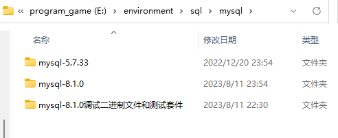
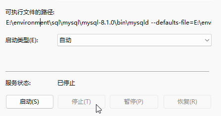

# mysql

## 0 安装

同时安装两个以上的mysql应该怎么做呢？

这个安装在我刚接触时极为复杂

​	如果你的电脑有mysql并且mysql是解压版本配置了环境变量，那么接下来的步骤可能对你有很大的帮助

​	**1.删除掉你设置的path中mysql的环境变量**，因为当你只有一个mysql服务时，环境变量可以很方便的访问mysql，但如果有两个甚至更多时，其他版本的数据库可能都会变成唯一的一个。

​	**2.删除原有的mysql服务。**

打开管理员模式的cmd，进入原先安装好的mysql的bin目录下  用以下代码删除MySQL服务

```bash
mysqld --remove
```

下载并解压好新的mysql-8.1.0



​	**3.配置my.ini  通过更改两个mysql的端口来区分数据库**

原先的mysql-5.7.33

```ini
[mysqld]
# 设置3305端口
port=3305
#设置时区为东八区，此项设置后，在连接MySQL的时候可以不用每次都手动设置时区
default-time-zone = '+8:00'
# 设置mysql的安装目录   ----------是你的文件路径-------------
basedir=E:\\environment\\sql\\mysql\\mysql-5.7.33
# 设置mysql数据库的数据的存放目录  ---------是你的文件路径data文件夹自行创建
datadir=E:\\environment\\sql\\mysql\\mysql-5.7.33\\data
# 允许最大连接数
# max_connections=200
# 允许连接失败的次数。
# max_connect_errors=10
# 服务端使用的字符集默认为utf8
character-set-server=utf8
# 创建新表时将使用的默认存储引擎
default-storage-engine=INNODB
[mysql]
# 设置mysql客户端默认字符集
default-character-set=utf8
[client]
# 设置mysql客户端连接服务端时默认使用的端口
# port=3305
default-character-set=utf8
```

刚刚解压的mysql-8.1.0,新建my.ini文件

```ini
[mysqld]
# 设置3306端口
port=3306
#设置时区为东八区，此项设置后，在连接MySQL的时候可以不用每次都手动设置时区
default-time-zone = '+8:00'
# 设置mysql的安装目录   ----------是你的文件路径-------------
basedir=E:\\environment\\sql\\mysql\\mysql-8.1.0
# 设置mysql数据库的数据的存放目录  ---------是你的文件路径data文件夹自行创建
datadir=E:\\environment\\sql\\mysql\\mysql-8.1.0\\data
# 允许最大连接数
# max_connections=200
# 允许连接失败的次数。
# max_connect_errors=10
# 服务端使用的字符集默认为utf8
character-set-server=utf8
# 创建新表时将使用的默认存储引擎
default-storage-engine=INNODB
# 默认使用mysql_native_password caching_sha2_password”插件认证 
# default_authentication_plugin=mysql_native_password 
# 解决导入脚本时funtion报错 
log_bin_trust_function_creators=1 
[mysql]
# 设置mysql客户端默认字符集
default-character-set=utf8
[client]
# 设置mysql客户端连接服务端时默认使用的端口
port=3306
default-character-set=utf8
```

> 其中的参数，了解的可自行修改。
>
> [MySQL配置文件（my.ini）详解](https://bbs.huaweicloud.com/forum/thread-99790-1-1.html)

​	4.安装mysql服务

mysql-5.7.33

因为以前有data文件，所以没有进行初始化

管理员模式cmd，进入mysql-5.7.33的bin目录下

```bash
mysqld install mysql5 --defaults-file="E:\environment\sql\mysql\mysql-5.7.33\my.ini"
```

打开mysql5服务

```bash
net start mysql5
```

测试登录

```bash
mysql -uroot -p****** -P3305
```

mysql-8.1.0

先对其进行初始化生成data文件夹		管理员模式cmd，进入mysql-8.1.0的bin目录下

```bash
mysqld  --defaults-file="E:\environment\sql\mysql\mysql-8.1.0\my.ini" --initialize-insecure
```

生成了data目录，然后创建mysql8服务

```bash
mysqld install mysql8 --defaults-file="E:\environment\sql\mysql\mysql-8.1.0\my.ini"
```

测试运行	net start mysql8

**什么？运行失败？服务启动不了？**

打开服务找到刚刚创建的mysql服务，分别查看它们的属性。




有极大的可能新安装的mysql8的可执行文件路径用的mysqld是mysql5.7的，所以我们去注册表更改信息

打开注册编辑表，找到这个路径 计算机\HKEY_LOCAL_MACHINE\SYSTEM\CurrentControlSet\Services\mysql8

修改ImagePath属性修改其mysqld的路径并刷新服务观察修改成功后，在尝试运行

**注意：运行时，因为没有配置环境变量一定要在指定路径启动服务**

​	5.运行

一般按照以上操作，mysql8登陆时是没有密码的

直接登陆进去后创建密码

```mysql
alter user 'root'@'localhost' identified by 'newPassword';
```

《不出意外》，安装成功。

